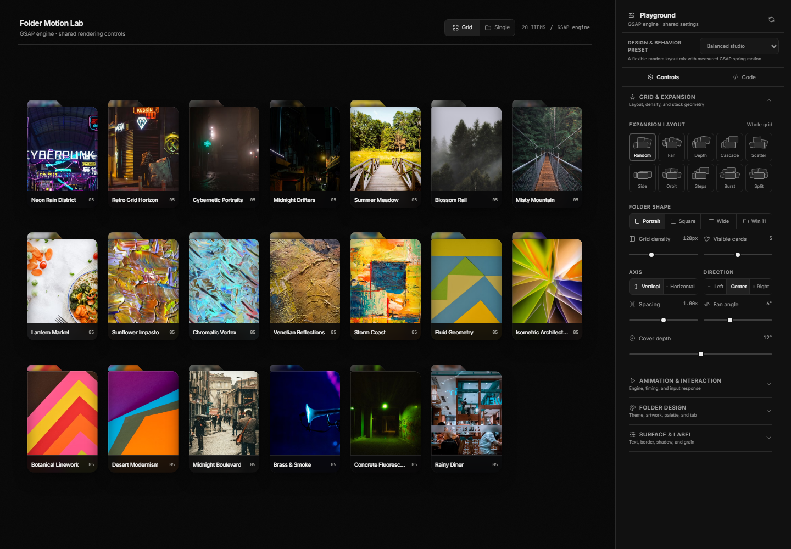
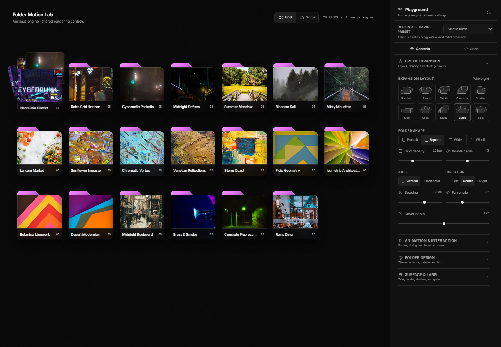
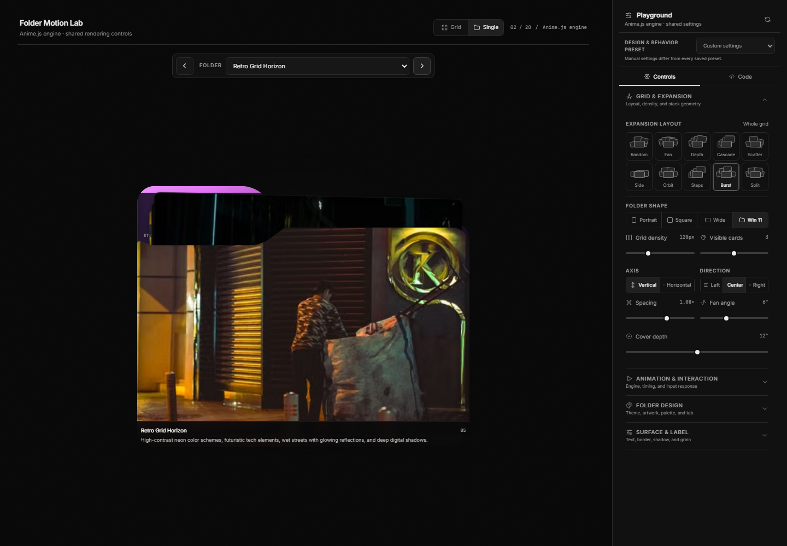
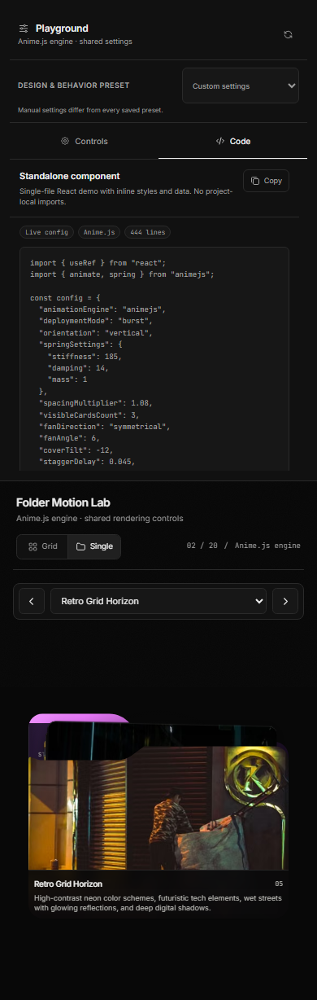

<p align="center">
  <picture>
    <source media="(prefers-color-scheme: dark)" srcset="https://shieldcn.dev/header/folder.svg?title=Folder+Component&subtitle=Compare+five+animation+engines+on+one+interactive+folder&logo=react&theme=purple&align=center&mode=dark" />
    
  </picture>
</p>

<p align="center">
  <a href="https://github.com/gvastethecreator/folder-component/actions/workflows/ci.yml"></a>
  <a href="https://github.com/gvastethecreator/folder-component/stargazers"></a>
  <a href="https://github.com/gvastethecreator/folder-component/commits/main"></a>
  <a href="https://gvastethecreator.github.io/folder-component/"></a>
  <a href="LICENSE"></a>
</p>

A browser playground for comparing five animation engines on the same interactive folder
component: **GSAP**, **Motion**, **Anime.js**, pure **CSS**, and native **WAAPI**.

[Open the live playground](https://gvastethecreator.github.io/folder-component/)

## Product tour

| Five-engine grid                                                                                                                 | Kinetic preset                                                                                                                     |
| -------------------------------------------------------------------------------------------------------------------------------- | ---------------------------------------------------------------------------------------------------------------------------------- |
|  |                   |
| **Single-folder studio**                                                                                                         | **Mobile code export**                                                                                                             |
|          |  |

## Features

- Switch animation engines without changing folder geometry or content.
- Browse 20 curated folders with a different cover image on every folder.
- Toggle between the responsive grid and a full-size single-folder preview with collection browsing.
- Randomize the grid or force one of nine expansion layouts across every folder.
- Scale a responsive 1–9 column grid through one folder-size/density control.
- Switch between classic, diagonal, rounded, and Windows 11 folder silhouettes.
- Apply six color palettes or a custom color from the native picker.
- Tune tab size/alignment, cover opacity/blur, label glass, border weight/opacity/radius, and SVG
  noise.
- Load complete design and behavior presets from the top dropdown.
- Copy a live single-file React component from the Code panel; styles and demo data are embedded,
  with no project-local file imports.
- Use keyboard, pointer, or touch interactions with reduced-motion support.
- Keep working when remote Pexels images fail through deterministic neutral fallbacks.

## Quick start

Use the repository runtime baseline: Node.js 24.15.0 and pnpm 11.21.0.

```sh
pnpm install
pnpm run dev
```

Open `http://localhost:3000`.

## Verify

```sh
pnpm run typecheck
pnpm run lint
pnpm run format:check
pnpm run test
pnpm run test:e2e
pnpm run build
pnpm run deps:check
```

## Documentation

- [Project readiness baseline](docs/project-readiness.md)
- [Architecture and engine contract](docs/architecture.md)
- [GitHub Pages deployment](docs/deployment.md)
- [Known tradeoffs](docs/technical-debt.md)
- [Dependency decisions and changelogs](docs/dependencies.md)
- [Maintenance guide](docs/maintenance.md)

The app is fully static. It has no backend, secrets, API keys, or required environment
variables. Pexels imagery is used under the [Pexels license](https://www.pexels.com/license/).

## Status

- Local gates cover 98 unit tests and 22 Chromium end-to-end scenarios.
- Firefox, Safari, and manual screen-reader testing are not part of the automated baseline.
- Motion and Anime.js load on demand and prefetch on pointer or keyboard intent. The initial
  JavaScript bundle is 118.28 kB gzip, down from 151.67 kB before this split.

## License

[MIT](LICENSE)

## Support

<p align="center">
  <a href="https://github.com/sponsors/gvastethecreator"></a>
</p>

Support continued development through [GitHub Sponsors](https://github.com/sponsors/gvastethecreator) or [Ko-fi](https://ko-fi.com/gvaste).
